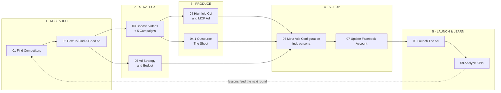

# Meta Ads — the process

Ten steps, one loop. Research feeds strategy, strategy feeds creative, creative goes live,
the numbers come back and feed the next round of research.

Section 2 of [[Process.excalidraw|Process.excalidraw.md]] is the same loop seen from above —
open it first. Every tile on it is a folder here. It is the single drawing for the whole
process (the old `Meta Ads.canvas` was removed 2026-09-02); steps do not get drawings of
their own.

One level up, [[process/README|Process]] lists all five channels and
[[process/Process.excalidraw|draws them]]. **Meta Ads is the active one** — the other four sit
parked in `process/todo/` until this loop produces a winner worth repeating.

Product facts are not repeated in this folder. They live in `../../../PRODUCT.md` and are
linked to.

## One step = one folder

```
NN Step Name/
├── NN Step Name.md    documentation — goal, process, gate, outputs. The drawing's tile.
├── NN TODO.md         the checklist. The only place checkboxes live.
└── …                  the notes this step produces, in the same folder
```

Paths in a step's **Output** section are relative to that step's own folder. A note lives
where the step that produced it lives — there is no shared `docs/` tree any more.

## Steps

Status is in each step doc's frontmatter — this table is a map, not a tracker.

| # | Step | TODO | Phase | Produces |
|---|---|---|---|---|
| 01 | [[01 Find Competitors]] | [[01 TODO]] | research | `Competitor Landscape.md`, `competitors/<Name>.md` |
| 02 | [[02 How To Find A Good Ad]] | [[02 TODO]] | research | `Swipe Method.md`, `Hooks And Angles.md`, `swipe/` |
| 03 | [[03 Choose Videos And Five Campaigns]] | [[03 TODO]] | strategy | `briefs/<name>.md` ×5, `Creative Naming.md` |
| 04 | [[04 Highfield CLI And MCP Ad]] | [[04 TODO]] | produce | `highfield/Positioning.md`, `briefs/highfield-cli-mcp.md` |
| 04.1 | [[04.1 Outsource The Shoot]] | [[04.1 TODO]] | produce | `Production Platforms.md`, `Shoot Order.md` |
| 05 | [[05 Ad Strategy And Budget]] | [[05 TODO]] | strategy | `Budget And Thresholds.md`, `KPI.md` |
| 06 | [[06 Meta Ads Configuration]] | [[06 TODO]] | setup | `Persona.md`, `Meta Ads Configuration.md`, `Audiences.md` |
| 07 | [[07 Update Facebook Account]] | [[07 TODO]] | setup | `Account Setup.md` |
| 08 | [[08 Launch The Ad]] | [[08 TODO]] | launch | `Campaign Tracker.md`, `hypotheses/` |
| 09 | [[09 Analyze KPIs]] | [[09 TODO]] | launch | `KPI Review <date>.md`, `Retired Angles.md` |

03 and 05 run in parallel — the budget does not depend on which videos you pick, and picking
videos does not depend on the budget. Both must land before 06.

**04 is `blocked` and is not a WinkyPie step.** Highfield CLI & MCP is a developer product
with a different buyer and probably a different channel. It keeps slot 04 because it shares
the production pipeline; read the banner at the top of the file before touching it.

## The loop



## Gates

Each arrow has a condition. If it is not met, the work goes back left — it does not move on.

| Move | Gate |
|---|---|
| research → strategy | A named competitor gap, backed by evidence. Not a hunch. |
| strategy → produce | A brief per campaign. Hook written down before any footage exists. |
| produce → setup | QA passed: men only, AI disclosed, no unsourced stat, no implied-different-person before/after. |
| setup → launch | Tracking verified end to end. A campaign you cannot measure is a donation. |
| launch → learn | Hypothesis written **before** spend starts, then left alone through the learning phase. |

## Where this breaks

Recurring failure modes, and what actually causes them:

| Symptom | Real cause | Fix |
|---|---|---|
| "We have no creative ideas" | Skipping the research step | [[02 How To Find A Good Ad]] — timeboxed, weekly, non-negotiable |
| Results cannot be compared | Naming drift across creatives | Fix the naming convention in [[03 Choose Videos And Five Campaigns]] |
| "Which change caused it?" | Two variables tested at once | One variable per campaign — [[05 Ad Strategy And Budget]] |
| Ads killed too early | Judging inside the learning phase | Thresholds live in [[09 Analyze KPIs]], not in your gut |
| The same dead angle keeps coming back | No lesson written after the kill | Every kill writes a line in the step's Output |
| Ad rejected by Meta | Guardrails skipped at QA | Root `CLAUDE.md` guardrails, checked before upload |

## Rhythm

- **Weekly** — 30 minutes of research (01/02), even when nothing is broken. This is the input
  to everything else and it is the first thing to get dropped.
- **Per campaign** — 03 → 04.1 (outsourced shoot) → 06 → 08.
- **At threshold, not on a schedule** — 09. Read the funnel top-down and fix only the worst
  step. Fixing two steps at once teaches you nothing.

## Adding a step

Copy `_Template/` to `NN Step Name/`, rename both files, fill them in, then add a row to the
table above and a tile to the loop in [[Process.excalidraw|Process.excalidraw.md]] — new
Excalidraw elements are drawn in Obsidian, not edited as text.

`NN` is the step's position in the loop, not its priority. Insert urgent work as a decimal —
`06.1 Fix Pixel Events/` — rather than renumbering. Renumbering breaks the drawing and every
wiki link pointing at it.
